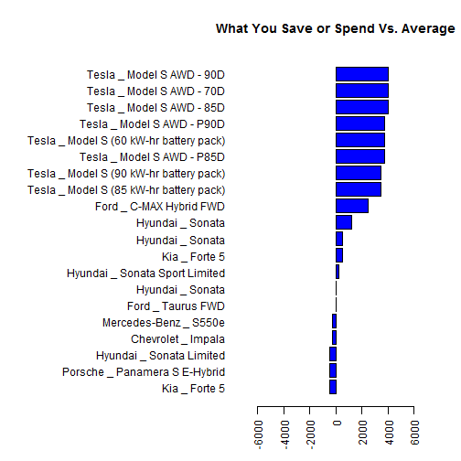

Car Finder Application
========================================================
author: Charlie LeCrone 
date: November 19th, 2017
autosize: true

Background 
========================================================
The Objective of my Shiny Application is to provide a search
utility for publicly available data on vehicle fuel costs.

The data I used for the project came from the US EPA Website: <https://www.fueleconomy.gov/feg/download.shtml>.

The data set is simplified to the following elements:

- Vehicle Class
- Make and Model
- Model Year
- Cylinders, Displacement, Drive Type, and Transmission Type
- You Save / Spend (variance in 5 year fuel cost vs. average)


Data Prep
========================================================
The following code takes the raw data from the EPA and prepares if for 
use in the App:


```r
## Car Comparisions

library(dplyr)
library(ggplot2)

# Get data

d1<-read.csv("./rawcardata.csv")
d2<-d1 %>%
  select(youSaveSpend, VClass, year, make, model, cylinders, displ, drive, trany)
d2$MakeModel<-paste(d2$make, "_", d2$model)
d2<-select(d2, VClass, year, MakeModel, cylinders, displ, drive, trany, youSaveSpend)
names(d2)<-c("Class", "Year", "MakeModel", "Cylinders", "Displacement", "DriveType", "Transmission", "SaveSpend")
d2<-d2%>%
    filter(Year>1996)
```

Reactive Code
========================================================
This code preps the larger data for the reactive plot.  The
"Class" and "Year" values will be the reactive input within 
the App:


```r
d2<-d2 %>%
  filter(Class=="Large Cars" & Year==2015)%>%
  arrange(SaveSpend) %>%
  tail(20)
# Create barplot with base graphics
par(mar=c(4.1,18.1,4.1,2.1))
barplot(height=d2$SaveSpend, names.arg = d2$MakeModel, 
        xlab="", las=2, cex.axis = 1, 
        cex.names = 1, horiz = T, col = "blue", 
        xlim = c(-7500,7500))
title(main="What You Save or Spend Vs. Average")
```

Plot
========================================================
Here is what the plot looks like:



Visit the actual app at:
<https://lecroc1028.shinyapps.io/CarFinder/>
